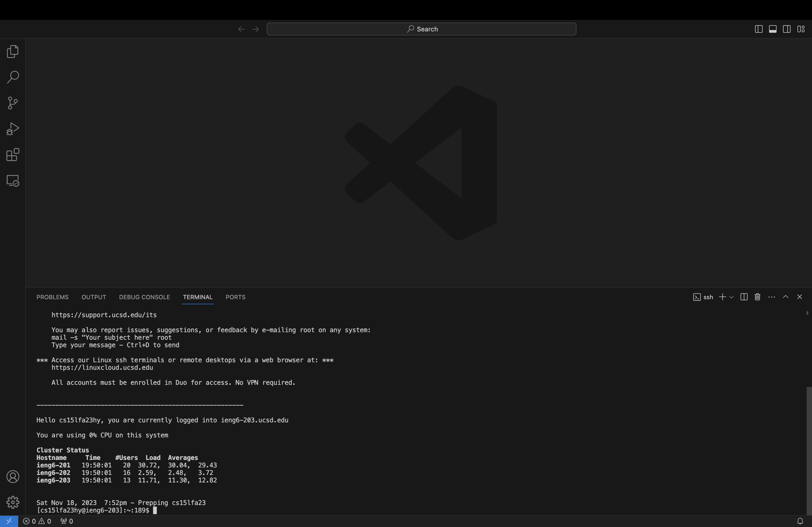
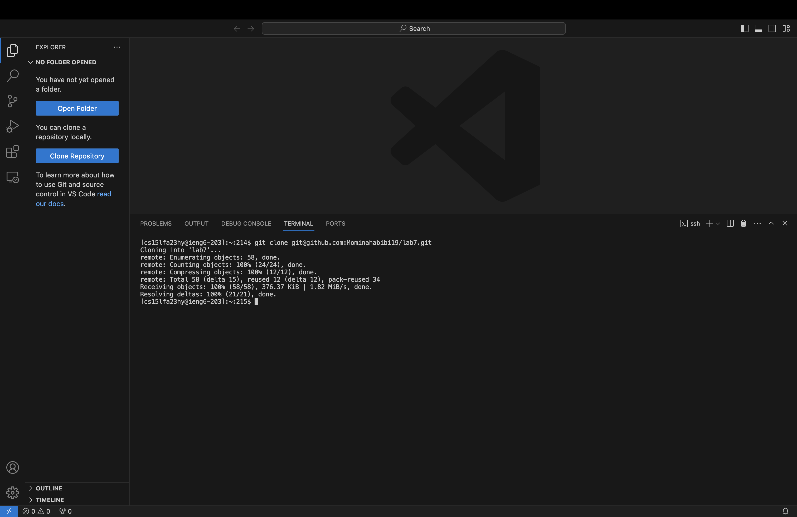
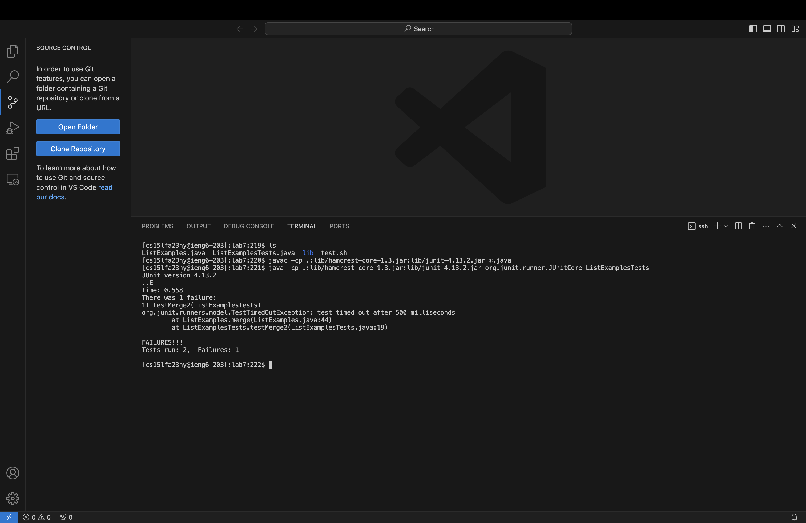
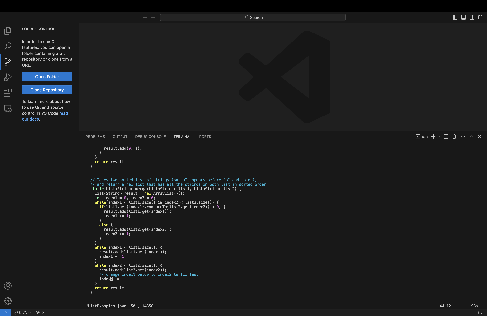
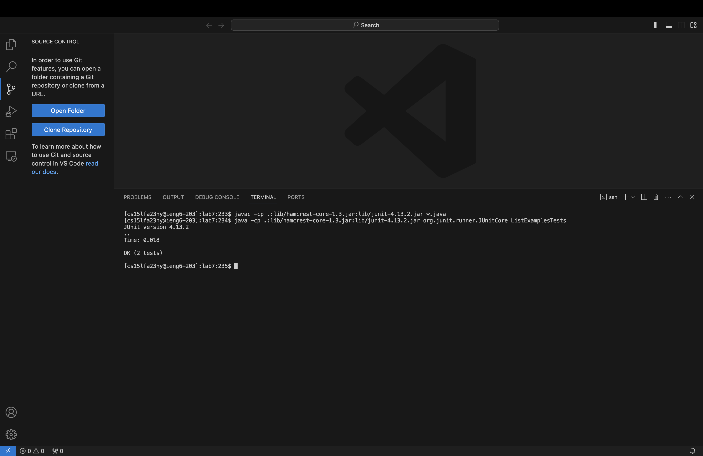
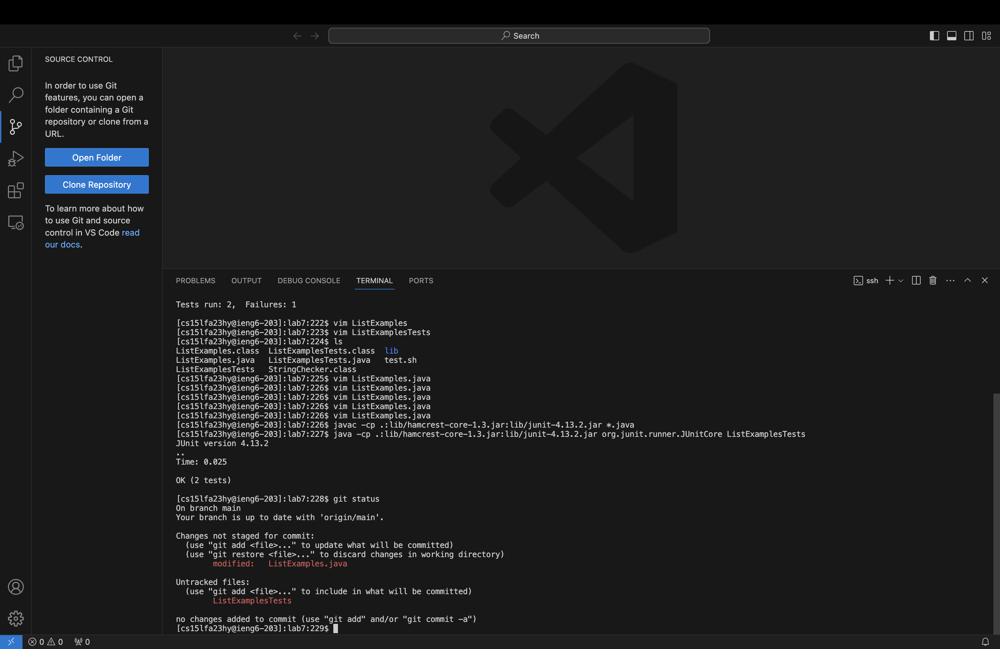
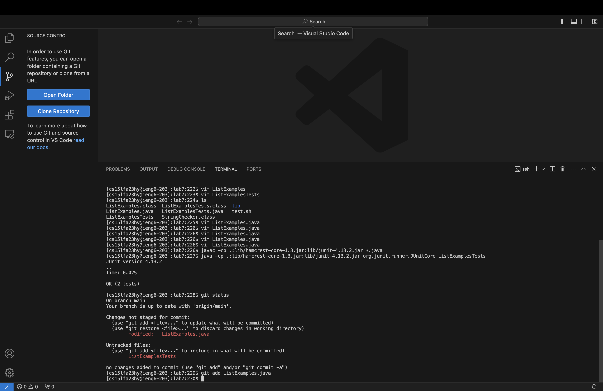
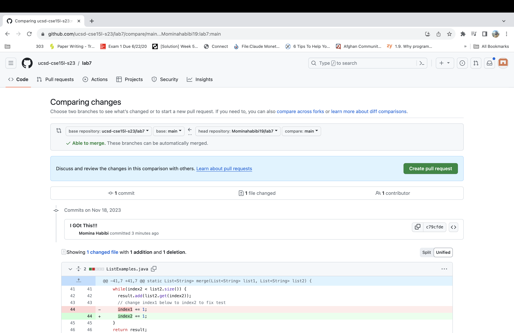

# Lab Report 4 - Vim (Week 7)
*by Momina Habibi*

## 4. Log into ieng6

I opened Visual Studio Code then I opened the terminal. I just typed 
`
ssh cs15lfa23hy@ieng6.ucsd.edu
`
then 
`
<enter>
`
So by using the command ssh, I log in to my remote server. 

## 5. Clone your fork of the repository from your Github account (using the SSH URL)

First I open my Github account and copy the SSH URL for lab7

Keys pressed: `clear`, `git clone <ctrl + v> ` , `<enter>`

## 6. Run the tests, demonstrating that they fail

Keys pressed: `cd lab7`, `clear`, `ls`, then I opened lab week4 I select `javac -cp .:lib/hamcrest-core-1.3.jar:lib/junit-4.13.2.jar *.java` , `<ctrl+c>`, then I opened the terminal `<ctrl+v>`, `<enter>`. I did exactly the same thing for `java -cp ".;lib/junit-4.13.2.jar;lib/hamcrest-core-1.3.jar" org.junit.runner.JUnitCore ArrayTests` but I change the name of the file to ListExampleTests `java -cp ".;lib/junit-4.13.2.jar;lib/hamcrest-core-1.3.jar" org.junit.runner.JUnitCore ListExampleTests` `<enter>`

Summarize of the commands I ran and the effect of those key presses: cd lab7 - I changed my current directory to lab7. clear - I like to clear my terminal so It gives me a clean workspace. ls - to see all the list of files and directory of lab 7 so I know which file should I test. javac -cp - compiles all java files using specified classpath to include JUnit and hamcrest lib for running tests. java -cp - runs the Junit tests contained in the ListExampleTests class.

## 7. Edit the code file to fix the failing test

Keys pressed: `vim ListExamples.java`, `/index1 <enter>` , 18 times `<down>` `<right> <right> <right>` , `<i>` `<backspace>` type `2`, `<esc>`, `:wq` 

Summarize of the commands I ran and the effect of those key presses: vim ListExamples.java - opens the file in vim test editor. /index1 - begin a search for the string index1. 18 times down arrow key because the cursor was the first occurrence of index1 and I wanted the one in the final loop. the 3 time right to move the cursor to the position I want it. i - enter to insert mode in vim. backspace - deletes the character to the left of the cursor. 2 - inserts the character 2 so my test run successful. esc - exit the insert mode and return to normal mode. :wq - save the changes and quit vim it means close the editor. 

## 8. Run the tests, demonstrating that they now succeed

Keys pressed: `clear` , `<up> <up> <up> <up>` , `javac -cp .:lib/hamcrest-core-1.3.jar:lib/junit-4.13.2.jar *.java`, <enter>` , `<up> <up> <up> <up>' , `java -cp .:lib/hamcrest-core-1.3.jar:lib/junit-4.13.2.jar org.junit.runner.JUnitCore ListExamplesTests`, `<enter>`

Summarize of the commands I ran and the effect of those key presses: 4 times up - means pressing up arrow key 4 times so I can access to my command history that I executed previously. Then I compile Java file with a specified classpath. Then again I looked at the command history by pressing up arrow key 4 times and I found java -cp ... and I entered to run java with classpath and the JUnit runner class that executes tests of ListExamplesTests. Because I fixed the error now it succeeded.

## 9. Commit and push the resulting change to your Github account

