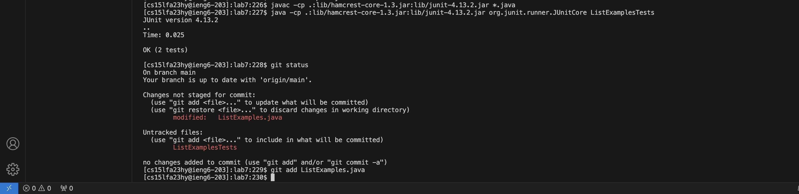

# Lab Report 4 - Vim (Week 7)
*by Momina Habibi*

## 4. Log into ieng6

I opened Visual Studio Code then I opened the terminal.

Keys pressed: `ssh cs15lfa23hy@ieng6.ucsd.edu` then `<enter>`

Summarize of the commands I ran and the effect of those key presses: by using the command ssh, establish a secure connection to my remote server so I log in to my remote server. 

## 5. Clone your fork of the repository from your Github account (using the SSH URL)

First I open my Github account and copy the SSH URL for lab7

Keys pressed: `clear`, `git clone <ctrl+v>`, `<enter>`

Summarize of the commands I ran and the effect of those key presses: clear command it clear my terminal, I like it because It gives me a clean workspace. git clone command is used to make a copy of an existing repository into a new directory on your local machine.

## 6. Run the tests, demonstrating that they fail

Keys pressed: `cd lab7`, `clear`, `ls`, then I opened lab week4 I select `javac -cp .:lib/hamcrest-core-1.3.jar:lib/junit-4.13.2.jar *.java` , `<ctrl+c>`, then I opened the terminal `<ctrl+v>`, `<enter>`. I did exactly the same thing for `java -cp ".;lib/junit-4.13.2.jar;lib/hamcrest-core-1.3.jar" org.junit.runner.JUnitCore ArrayTests` but I change the name of the file to ListExampleTests `java -cp ".;lib/junit-4.13.2.jar;lib/hamcrest-core-1.3.jar" org.junit.runner.JUnitCore ListExampleTests` `<enter>`

Summarize of the commands I ran and the effect of those key presses: cd lab7 command changed my current directory to lab7. ls command lists all the list of files and directories of lab 7 so I know which file should I test. javac -cp - compiles all java files using specified classpath to include JUnit and hamcrest lib for running tests. java -cp - runs the Junit tests contained in the ListExampleTests class.

## 7. Edit the code file to fix the failing test

Keys pressed: `vim ListExamples.java`, `/index1 <enter>` , 18 times `<down>` `<right> <right> <right>` , `<i>` `<backspace>` type `2`, `<esc>`, `:wq` 

Summarize of the commands I ran and the effect of those key presses: vim ListExamples.java - opens the file in vim test editor. /index1 - begin a search for the string index1. 18 times down arrow key because the cursor was the first occurrence of index1 and I wanted the one in the final loop. the 3 time right to move the cursor to the position I want it. pressing i - enter to insert mode in vim. backspace - deletes the character to the left of the cursor. 2 - inserts the character 2 so my test run successful. esc - exit the insert mode and return to normal mode. :wq - save the changes and quit vim it means close the editor. 

## 8. Run the tests, demonstrating that they now succeed

Keys pressed: `clear` , `<up> <up> <up> <up>` , `javac -cp .:lib/hamcrest-core-1.3.jar:lib/junit-4.13.2.jar *.java`, <enter>` , `<up> <up> <up> <up>' , `java -cp .:lib/hamcrest-core-1.3.jar:lib/junit-4.13.2.jar org.junit.runner.JUnitCore ListExamplesTests`, `<enter>`

Summarize of the commands I ran and the effect of those key presses: 4 times up - means pressing up arrow key 4 times so I can access to my command history that I executed previously. Then I compile Java file with a specified classpath. Then again I looked at the command history by pressing up arrow key 4 times and I found java -cp ... and I entered to run java with classpath and the JUnit runner class that executes tests of ListExamplesTests. Because I fixed the error now it succeeded.

## 9. Commit and push the resulting change to your Github account

Keys pressed: `git status`, `<enter>`, `git add ListExamples.java`, `enter`, `git commit`, `<enter>`, `<i>` I typed comment `I GOT THIS!!!`, `<esc>`, `:wq` then `<enter>`, `git push`. 

Summarize of the commands I ran and the effect of those key presses: git status - this command displays the state of the working directory and it shows which changes have been staged and which haven't. git add command preparing the file ListExamples.java to be saved in your next commit of the repository. it means stages the file ListExamples.java for the next commit. git commit command open vim text editor so that i can write a commit message. pressing i in vim change the mode to inserting mode and I typed, "I GOT This!!!". pressing esc exit the insert mode and :wq save and exit the vim. git push command is used to upload local repository content to a remote repository in this case to my GitHub account. Finally, I opened my GitHub account and I saw that the commit was successfully pushed as I saw the new commit message "I GOT This!!!" in my GitHub repository. 

