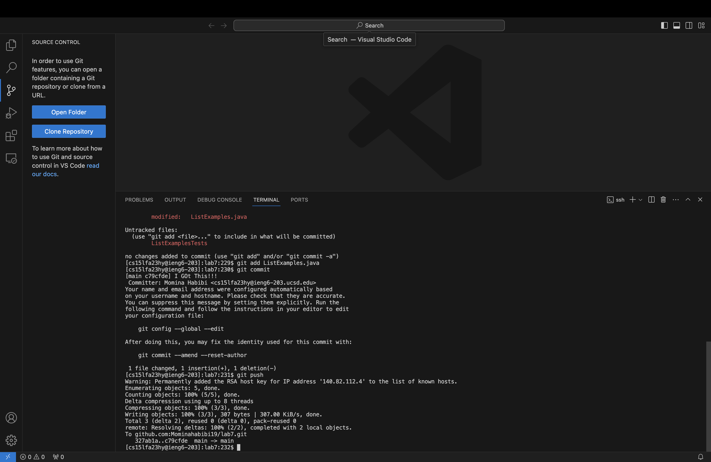

# Lab Report 4 - Vim (Week 7)
*by Momina Habibi*

## 4. Log into ieng6

## 5. Clone your fork of the repository from your Github account (using the SSH URL)

## 6. Run the tests, demonstrating that they fail

## 7. Edit the code file to fix the failing test

## 8. Run the tests, demonstrating that they now succeed

## 9. Commit and push the resulting change to your Github account

